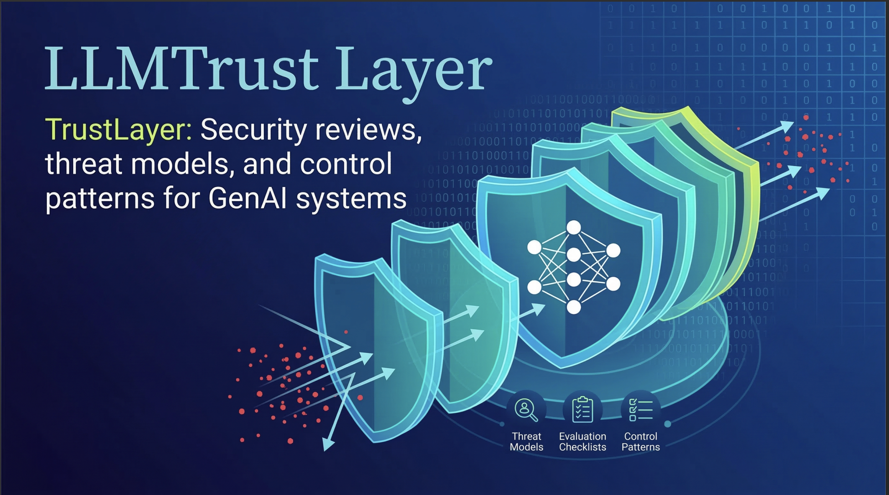
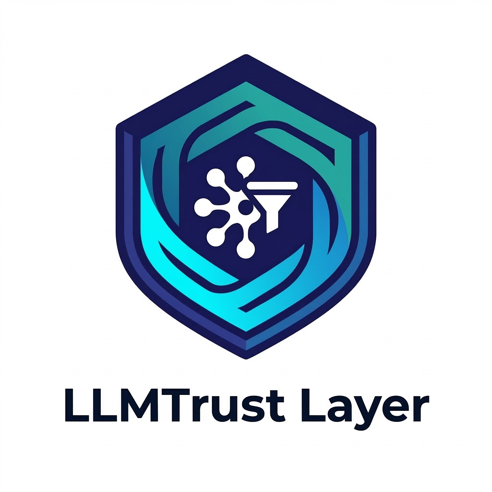

# LLMTrust Layer (A LLM Security Evaluation Framework - LSEF) and AISPM Tool



> A practitioner-grade framework for evaluating, scoring, and mitigating security risks in Large Language Model systems and GenAI-powered applications — built from real-world security engineering experience at hyperscale cloud environments.

[](https://creativecommons.org/licenses/by/4.0/)
[](CONTRIBUTING.md)
[](https://owasp.org/www-project-top-10-for-large-language-model-applications/)

---

## Why This Framework Exists

Security frameworks for traditional software are mature and well-documented. Security frameworks for LLM systems are not.

Most organisations deploying GenAI today are making security decisions without structured evaluation criteria — assessing prompt injection risk differently across teams, lacking consistent threat models for model weight protection, and applying traditional AppSec checklists to fundamentally different attack surfaces.

This framework was developed from the experience of leading GenAI security programs across large engineering organisations — evaluating security risks in production LLM deployments, designing security tooling for AI-powered workflows, and building the evaluation criteria that allowed security teams to assess GenAI risk consistently at scale.

It is not academic. Every threat category, checklist item, and mitigation pattern here emerged from security engineering work on enterprise systems.

---

## Who This Is For

- **Security engineering teams** evaluating LLM systems before production deployment
- **Security managers** building GenAI security programs across engineering organisations
- **AppSec engineers** conducting threat models on AI-powered features
- **AI/ML teams** who want to understand the security implications of their architectural decisions
- **Risk and compliance teams** establishing security criteria for GenAI vendor evaluation

---

## Framework Structure

```
LLMTrust-Layer/
│
├── README.md                          ← You are here
├── CONTRIBUTING.md                    ← How to contribute
├── CHANGELOG.md                       ← Version history
│
├── threat-model/
│   ├── README.md                      ← Threat modeling methodology
│   ├── 01-prompt-injection.md         ← Prompt injection threat category
│   ├── 02-training-data-poisoning.md  ← Training data attacks
│   ├── 03-model-weight-exfiltration.md← Model IP and weight protection
│   ├── 04-inference-attacks.md        ← Model inversion and extraction
│   ├── 05-supply-chain.md             ← LLM supply chain risks
│   ├── 06-data-exfiltration.md        ← Sensitive data leakage via LLM
│   ├── 07-agentic-workflow-risks.md   ← Risks in autonomous LLM agents
│   └── threat-model-template.md      ← Blank template for your system
│
├── evaluation-checklists/
│   ├── README.md                      ← How to use the checklists
│   ├── pre-deployment-checklist.md    ← Before going to production
│   ├── vendor-evaluation-checklist.md ← Evaluating third-party LLM providers
│   ├── agentic-system-checklist.md    ← For autonomous/agentic LLM systems
│   ├── rag-system-checklist.md        ← Retrieval-Augmented Generation security
│   └── ongoing-monitoring-checklist.md← Post-deployment continuous evaluation
│
├── risk-scoring/
│   ├── README.md                      ← Scoring methodology
│   ├── risk-scoring-model.md          ← Detailed scoring rubric
│   └── risk-scoring-template.xlsx     ← Spreadsheet template
│
├── mitigations/
│   ├── README.md                      ← Mitigation pattern overview
│   ├── prompt-injection-mitigations.md
│   ├── data-protection-mitigations.md
│   ├── access-control-mitigations.md
│   ├── monitoring-detection-patterns.md
│   └── organisational-controls.md
│
├── case-studies/
│   ├── README.md
│   ├── cs-01-llm-powered-escalation-triage.md
│   ├── cs-02-govcloud-region-review-automation.md
│   └── cs-03-agentic-security-review-automation.md
│
└── assets/
    ├── lsef-threat-model-diagram.png
    └── risk-scoring-overview.png
```

---

## Quick Start

### Step 1 — Classify Your System

Before applying the framework, classify your LLM system type:

| Type | Description | Primary Risks |
|------|-------------|---------------|
| **Type A: LLM-as-Feature** | LLM embedded in a product (copilot, summarisation, search) | Prompt injection, data exfiltration, insecure output handling |
| **Type B: LLM-as-Platform** | Internal platform other teams build on | Supply chain, access control, model weight protection |
| **Type C: Agentic System** | LLM with tool use, autonomous action capability | Privilege escalation, SSRF via tools, unintended action scope |
| **Type D: RAG System** | LLM with retrieval from internal knowledge bases | Data boundary violations, indirect prompt injection, over-retrieval |
| **Type E: Fine-Tuned/Custom Model** | Organisation trains or fine-tunes its own model | Training data poisoning, model exfiltration, IP protection |

### Step 2 — Run the Threat Model

Start with [`threat-model/README.md`](threat-model/README.md) to understand the methodology, then work through the threat categories relevant to your system type.

### Step 3 — Complete the Evaluation Checklist

Use the appropriate checklist from [`evaluation-checklists/`](evaluation-checklists/) for your system type and deployment stage.

### Step 4 — Score Your Risk Posture

Apply the scoring model in [`risk-scoring/risk-scoring-model.md`](risk-scoring/risk-scoring-model.md) to produce a quantified risk score and prioritised remediation roadmap.

### Step 5 — Apply Mitigations

Use [`mitigations/`](mitigations/) to identify and implement controls that address your highest-scoring risks.

### Step 6 — Use Zero Install AISPM Tool 

Download AISPM.html from the tools/ folder in LLMTrust-Layer. 
No Install Required
Download [AISPM.html](tools/AISPM.html) and open in any browser.
Requires internet access for API calls to your LLM Provider.

---

## Framework Principles

**1. Practitioner-First**
Every element of this framework comes from real security engineering work, not theoretical models. If something does not work in production, it is not in here.

**2. Risk-Based Prioritisation**
Not all LLM security risks are equal. The framework is designed to help you identify and focus on the risks that matter most for your specific system — not create security theatre by checking every possible box.

**3. Developer Empathy**
Security that slows down AI development will be bypassed. Every mitigation pattern in this framework is designed to be implementable without blocking the AI team's velocity.

**4. Proportionality**
A startup deploying a customer support chatbot faces different security requirements than an organisation deploying an agentic system with access to production databases. The framework scales to context.

**5. Living Document**
The LLM threat landscape evolves rapidly. This framework is versioned and updated as new attack patterns emerge in the field.

---

## Relationship to Existing Frameworks

This framework is designed to complement, not replace, existing security frameworks:

| Framework | Relationship |
|-----------|-------------|
| **OWASP LLM Top 10** | LSEF provides deeper evaluation methodology for each OWASP LLM risk category |
| **MITRE ATLAS** | LSEF threat categories map to ATLAS tactics and techniques |
| **NIST AI RMF** | LSEF evaluation checklists align with NIST AI RMF measurement categories |
| **OWASP SAMM** | LSEF can be integrated into SAMM practice activities for AI/ML security |
| **MITRE ATT&CK** | LSEF inference and supply chain threat categories reference ATT&CK techniques |

A detailed mapping document is available in [`assets/framework-mappings.md`](assets/framework-mappings.md).

---

## Current Version

**v0.1.0** — Initial release. Covers the seven primary threat categories, five evaluation checklists, risk scoring model, and three case studies.

See [CHANGELOG.md](CHANGELOG.md) for version history.

---

## Contributing

Contributions from security practitioners are actively welcomed — particularly:
- New threat categories emerging from real-world incidents
- Additional case studies (anonymised)
- Mitigation patterns validated in production environments
- Corrections and improvements to existing content

See [CONTRIBUTING.md](CONTRIBUTING.md) for guidelines.

---

## License

This work is licensed under [Creative Commons Attribution 4.0 International (CC BY 4.0)](https://creativecommons.org/licenses/by/4.0/). You are free to use, adapt, and redistribute with attribution.

---

## Author



**Amar Wakharkar** — Security Engineering Leader with 17 years of experience leading product security, including security automation. The threat categories, evaluation checklists, risk scoring model, and case studies in this framework reflect security engineering decisions made on production systems at hyperscale.

[LinkedIn](https://www.linkedin.com/in/amarwakharkar/) · [GitHub](https://github.com/amarwakh)

<br clear="left"/>

---

## Acknowledgements

Built on the shoulders of OWASP, MITRE ATLAS, and the broader security research community whose published work on LLM security made this practitioner synthesis possible.
